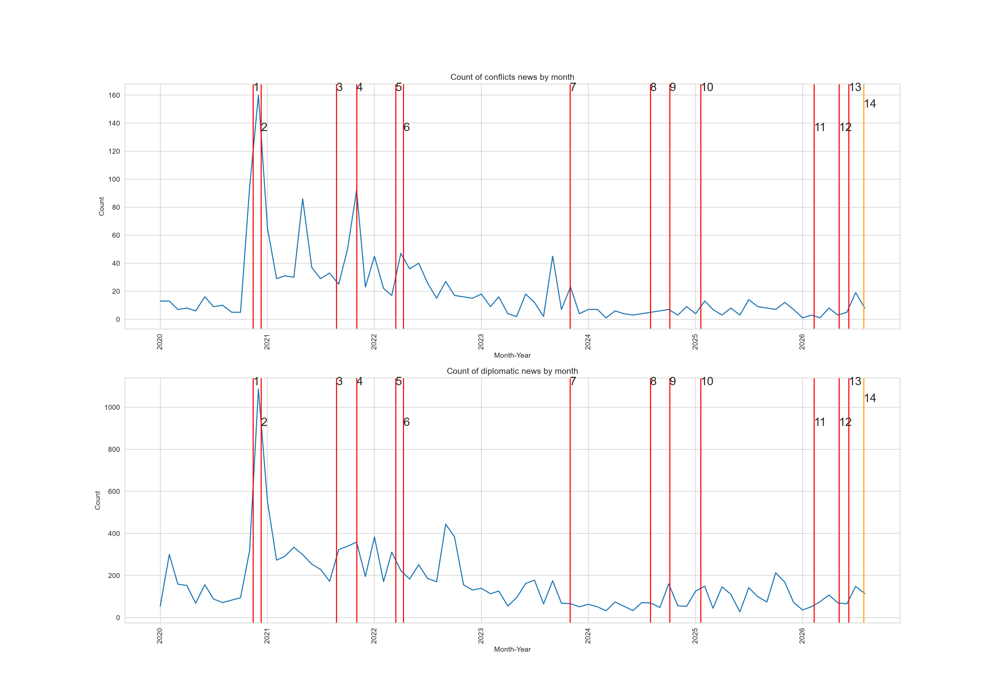
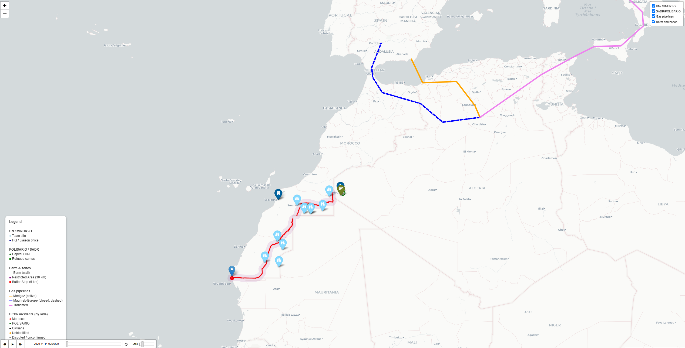

# Western Sahara Conflict Analysis

Analysis of the dynamics of a little-covered, low-intensity conflict between Morocco and the POLISARIO Front, based on GDELT and UCDP data.

---

## Problem

This conflict is a long-running standoff between the Kingdom of Morocco and the local independence movement — the POLISARIO Front, backed by Algeria — over control of the Western Sahara region. The territory was formerly a Spanish colony; after Spain withdrew its troops, Moroccan and Mauritanian forces moved in, marking the start of the active phase of the conflict. Today, roughly 80% of the territory is controlled by Morocco, which claims the land, while POLISARIO, which seeks an independent Sahrawi Arab Democratic Republic, holds only remote desert areas.

The topic was chosen because of the conflict's extremely low media coverage despite its scale and the specific character of this so-called "silent war." It also gave me a chance to put my ongoing practical interest in OSINT and cartography to use. The core practical goal of the research was to check whether spikes in news coverage line up with real events on the ground, and, along the way, to assess how reliable GDELT is as a data source.

---

## Method

ACLED was originally considered as the data source, but event-level access requires Research-tier approval with no guaranteed review timeline — this is why the project moved to GDELT, which has no such barrier.

**1. Data sources**
- GDELT: events and articles pulled via Google BigQuery, filtered by the Goldstein scale (for `conflicts`, GoldsteinScale ≤ -9).
- UCDP GED (Georeferenced Event Dataset): a dataset of confirmed armed-clash events and fatality data.

**2. Scraping and text processing**
- Full article text for the sources referenced by GDELT records was collected using the `trafilatura` library.
- Semantic flags were extracted via regular expressions and topical word lists in four languages (English, French, Arabic, Spanish). Two key flags were built: `casualty` (mentions of deaths/losses) and `repression` (mentions of repression/torture).

**3. Storage and matching**
- After type conversion, the tables were loaded into PostgreSQL.
- UCDP GED records were matched to GDELT events by timestamp (date).

**4. Analysis**
- SQL was used to analyze the overall dynamics of media mentions and to run a time-based analysis overlaying dates of external events potentially linked to the conflict, checking for correspondence with fluctuations in news volume.

**Visualization**
- **Interactive conflict map** — UN peacekeeping mission objects in the region are plotted (based on the mission's official map); key cities are marked with historical and military context, along with refugee camp locations, Algerian gas pipelines (reflecting changes in operational status over different periods), and the buffer zones and defensive wall (the Berm). A timestamped timeline is integrated for the UCDP GED data, allowing exploration of the dynamics of clashes and individual event descriptions.
- **Two-panel media-dynamics chart (Matplotlib)** — the top and bottom panels show the monthly dynamics of publication mentions by category (conflict-related and diplomatic content). 14 key external-date markers are overlaid on the chart to visually check whether peaks and dips in media activity line up with specific historical events.

*Labels 1–14 are explained in the table at the end of this document.*

---

## Insights

Algeria does not take part in this conflict directly by fighting Morocco. Instead, it supports the POLISARIO regime through diplomatic backing (for example, severing diplomatic relations with Morocco led to the closure of a gas pipeline — a coincidence that could be read as an attempt at pressure by Algeria; however, this coincided specifically with the break in diplomatic relations, and the main pipeline to Europe runs through Moroccan territory), as well as military and economic support — Algeria is the core base of the whole POLISARIO movement, hosting its main bases, the movement's headquarters, and refugee camps for people who fled the Western Sahara region. This is confirmed by an SQL query: for events involving Algeria, Actor1=12, Actor2=20.

On event types — there's no clear pattern showing that every external date drove a media spike: such matches don't always occur. The clearest example visible on the chart itself is the moment POLISARIO decided to break the ceasefire and launch full-scale hostilities (Guerguerat) — the largest spike on the chart, since that was when activity was at its most intense. Media activity declined afterward.

---

## Limitations

The dynamics analysis showed that correlation with external dates wasn't always present (for example, Guerguerat: `AVG(goldsteinscale)` barely changed even as the count jumped to 94/160 events). What grew was media coverage, not the severity of events.

GDELT systematically misclassifies certain events. Examples: an event in the database was categorized as conflict-related (since Goldstein values from -9 to -10 count as military violence), but on inspection the article turned out to be about Christopher Nolan's film "The Odyssey," which was filmed in the region. Separately, a news article about a planned diplomatic meeting in February 2026 was tagged by the filters with code 57 (as an already-signed agreement). In addition, `conflicts` picked up an event about the elimination of militants in the Egyptian desert by internal security forces — the region's name is a homonym of an Arabic phrase, and GDELT confused Western Sahara (the country/territory) with the "Western Desert of Egypt" (an ordinary geographic term within Egypt). On top of that, the event itself took place back in 2017.

The `casualty`/`repression` flags, given the issues above, didn't provide much specificity. In addition, some sites blocked the scraper, so scraping returned nothing for them. For example, in November 2020 the share of `has_casualty_mention` was only 7%, while 64% of that month's articles had a `no_fetch`/`no_extract` status.

`merge_asof` was set to a ±2-day window. The correctness of that choice was later confirmed, since reviewing news and reports showed that events could occur earlier or later than the recorded date (for example, the Guerguerat incident happened on the 13th, but the article appeared on the 14th–15th).

UCDP GED data is capped at January 18, 2025, so events from early 2026 onward are absent from it and were sourced externally instead.

*The full catalog of 6 GDELT error types and the rest of the underlying data — see [findings.md](findings.md).*

---

## Analytical Value

This project is a first-pass analysis of a low-profile conflict (its monitoring level is markedly lower than that of more prominent ones) — it shows what specifically to analyze and where to look.

For anyone monitoring little-known, low-profile conflicts without the capacity for continuous manual observation, this tool makes it possible to automatically spot notable spikes or events that warrant deeper follow-up analysis — without having to wade through noise and unconfirmed information.

The project also documents important GDELT shortcomings; knowing about them can help avoid related pitfalls, which is relevant for other low-profile, under-covered conflicts as well.

---

## Repository Structure

| File | Purpose |
|---|---|
| `main.py` | Scrapes full article text from GDELT sources via `trafilatura`, saves extraction status |
| `regex filter.py` | Extracts `casualty`/`repression` flags, matches against UCDP via `merge_asof` |
| `to_sql.py` | Final data-type processing, loads all tables into PostgreSQL |
| `map.py` | Builds the interactive conflict map (folium) |
| `visual-graphic.py` | Builds the two-panel dynamics chart (matplotlib) |
| `CAMEO.eventcodes.txt` | GDELT event code reference table |
| `*.kml`, `export.geojson` | Geodata for drawing the Berm and buffer zones |
| `*.csv` | Intermediate and final pipeline data at various processing stages |
| `findings.md` | Extended analysis: full UCDP verification (12 incidents), catalog of 6 GDELT error types |

Scripts run in this order: `main.py` → `regex filter.py` → `to_sql.py` → `map.py` / `visual-graphic.py`.

---

## How to Run

- Fully reproducing the pipeline from scratch requires Google Cloud / BigQuery access (to pull raw GDELT data) — the raw export itself isn't included due to its size.
- A `.env` file with PostgreSQL credentials and a CARTO API key is not included in the repository for security reasons — without it, `to_sql.py` and `map.py` won't run.
- `GEDEvent_v26_1.csv` (UCDP GED, ~260 MB) is not included due to GitHub's file-size limit — it's freely available at [ucdp.uu.se/downloads](https://ucdp.uu.se/downloads/).
- The finished pipeline outputs (map, chart, intermediate CSVs) are already in the repository and open without any additional setup.

---

## Technologies
-  Python (pandas, geopandas, shapely, trafilatura)
-  PostgreSQL (SQLAlchemy)
- **Google BigQuery** — GDELT data extraction
- **folium** — interactive map
- **matplotlib / seaborn** — dynamics chart
- **python-dotenv** — configuration
-  Git/GitHub

---

## Key Dates on the Chart

| # | Date | Event | Status |
|---|---|---|---|
| 1 | 13.11.2020 | After the events in Guerguerat (dispersal at the checkpoint), POLISARIO broke the ceasefire agreement in effect since 1991 | ✅ Confirmed |
| 2 | 10.12.2020 | The Trump administration recognized Morocco's sovereignty over Western Sahara | ✅ Confirmed, partly noise — calls, congratulations, commentary |
| 3 | 24.08.2021 | Algeria accused Morocco of hostile actions and severed diplomatic relations | ✅ Confirmed |
| 4 | 01.11.2021 | Three Algerian drivers came under fire and were killed | ✅ Confirmed |
| 5 | 14.03.2022 | Spain's Prime Minister sent an official letter to Morocco's King supporting the autonomy plan | ✅ Confirmed by external source |
| 6 | 10.04.2022 | Drone strikes in the grey zone killed Mauritanian gold prospectors; POLISARIO severed ties with Spain over its support for the Moroccan autonomy plan | ⚠️ Confirmed, partially — the data includes another case with the same context but a different date (3 January 2022) |
| 7 | 30.07.2024 | Official letter from French President Macron supporting the Moroccan autonomy plan | ✅ Confirmed by external source |
| 8 | 29.10.2023 | Explosions in the city of Smara | ✅ Confirmed |
| 9 | 04.10.2024 | The ECJ ruled that Morocco's sovereignty over Western Sahara does not extend to it, so EU–Morocco trade agreements do not apply to the SADR | ✅ Confirmed |
| 10 | 18.01.2025 | Moroccan media reported the elimination of a POLISARIO Front commander | ✅ Confirmed with a caveat — the exact death toll is unconfirmed |
| 11 | 09.02.2026 | Closed-door talks in Madrid on resolving the situation | ⚠️ Talks confirmed, but the code-based measurement method is unreliable |
| 12 | 05.05.2026 | Rocket/artillery strike on the city of Smara by POLISARIO | ✅ Confirmed |
| 13 | 07.06.2026 | Elimination of the commander of POLISARIO's 1st Reserve Brigade | ✅ Confirmed (source: SPS, the official SADR/POLISARIO outlet) |
| 14 | 28.07.2026 | Visual spike — on inspection, turned out to be an article about events from 1979 | ❌ Refuted, orange marker on the chart |